<h1 align="center">
  <br>
  
  <br>
  Sky Finance
  <br>
</h1>

<p align="center">
  Sistema pessoal de gestão financeira: despesas à vista e no cartão, faturas, contas fixas, renda, orçamentos, cofrinhos, dívidas com outras pessoas, lista de desejos, simulador de compras e backup automático — com tema escuro, claro e "gatos espaciais".
</p>

<p align="center">
  
  
  
  
</p>

> As telas abaixo usam um usuário de demonstração com dados fictícios.

---

## Telas

### Dashboard
Resumo do mês com renda, gastos e saldo, avisos de contas vencidas e faturas, "quanto sobra se me pagarem", parcelas que terminam no mês, gastos por categoria e cofrinhos.

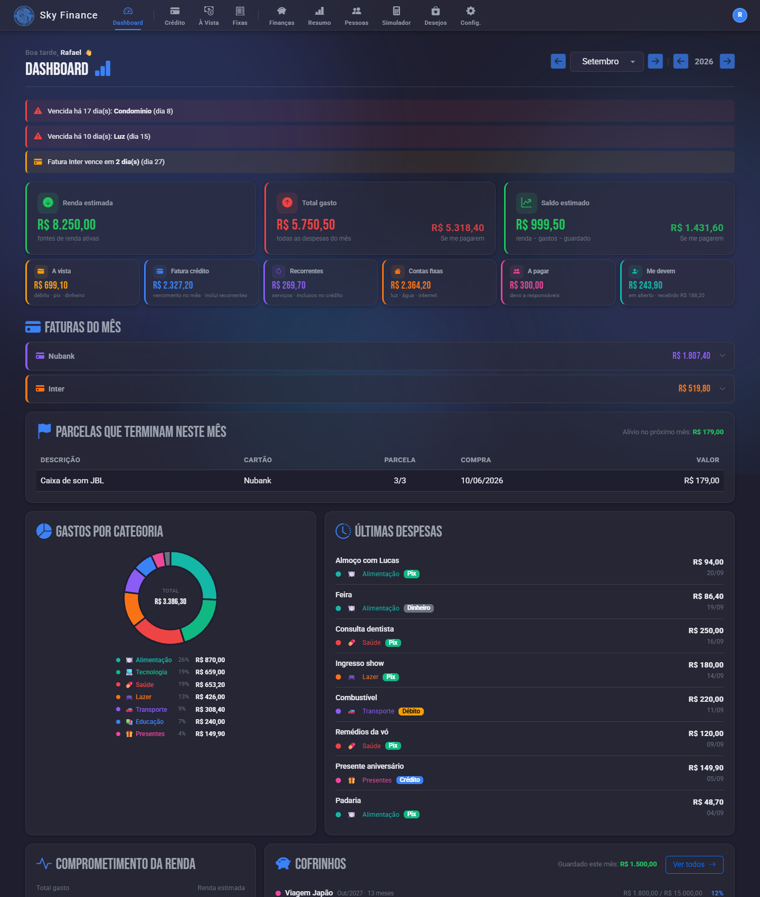

---

### Cartão de Crédito
Faturas por cartão com período (fecha · vence · melhor dia de compra), gráfico por categoria — clicar numa categoria filtra as faturas — e edição direto na linha.

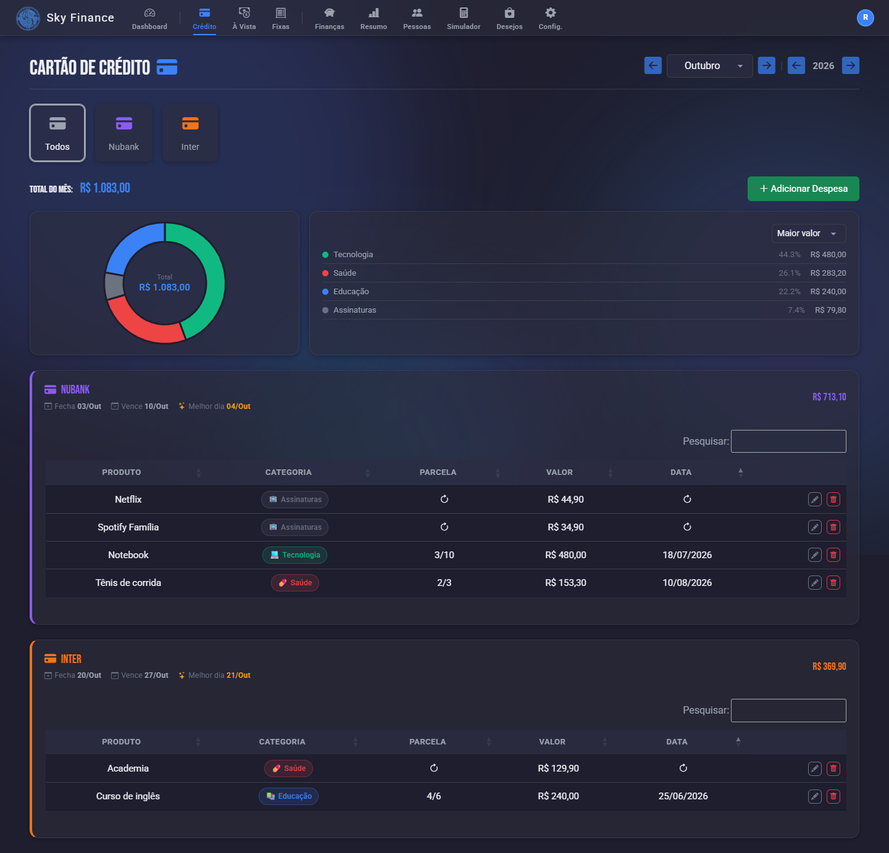

---

### À Vista
Pix, débito e dinheiro do mês.

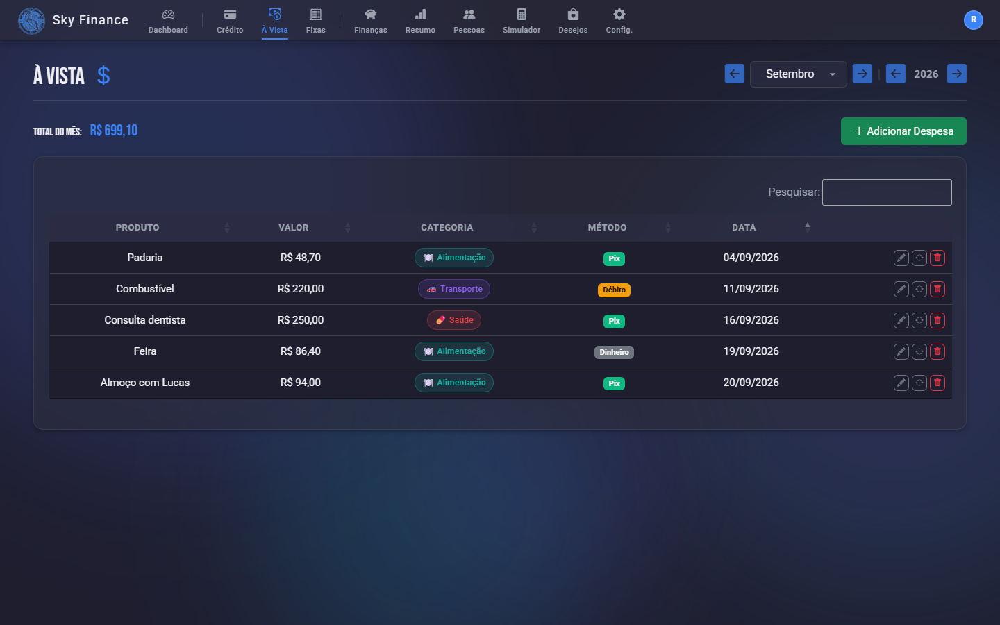

---

### Contas Fixas
Contas do mês com status (pago, a pagar, vencido); contas pagas por meio de outra pessoa aparecem como "via Mãe", por exemplo.

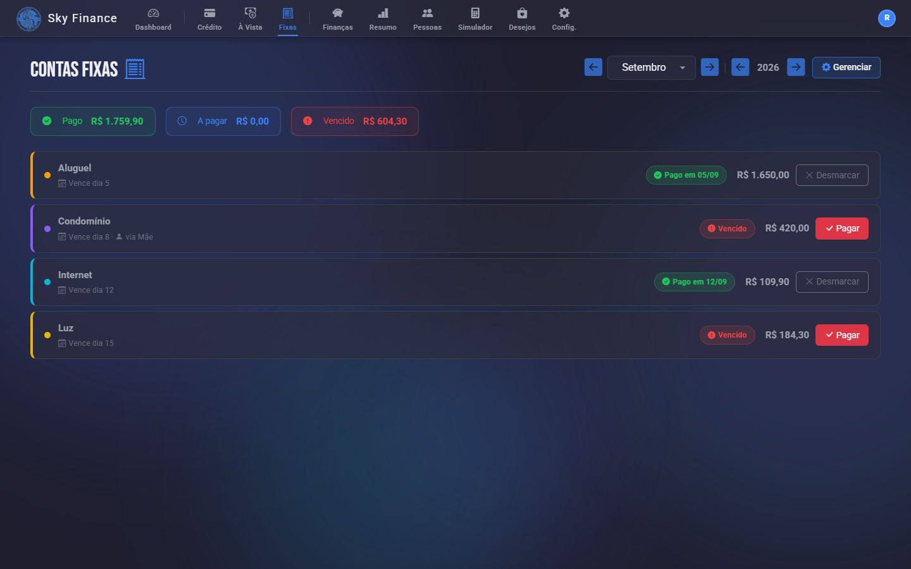

---

### Finanças
Fontes de renda, orçamento por categoria, meta de economia e cofrinhos com rendimento do CDI.

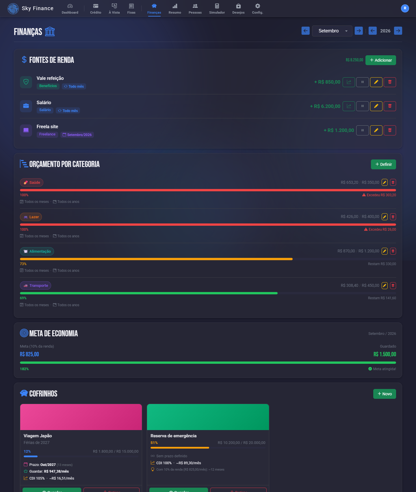

---

### Resumo Anual
Receitas × despesas por mês, evolução do saldo, gastos por categoria e tabela mensal.

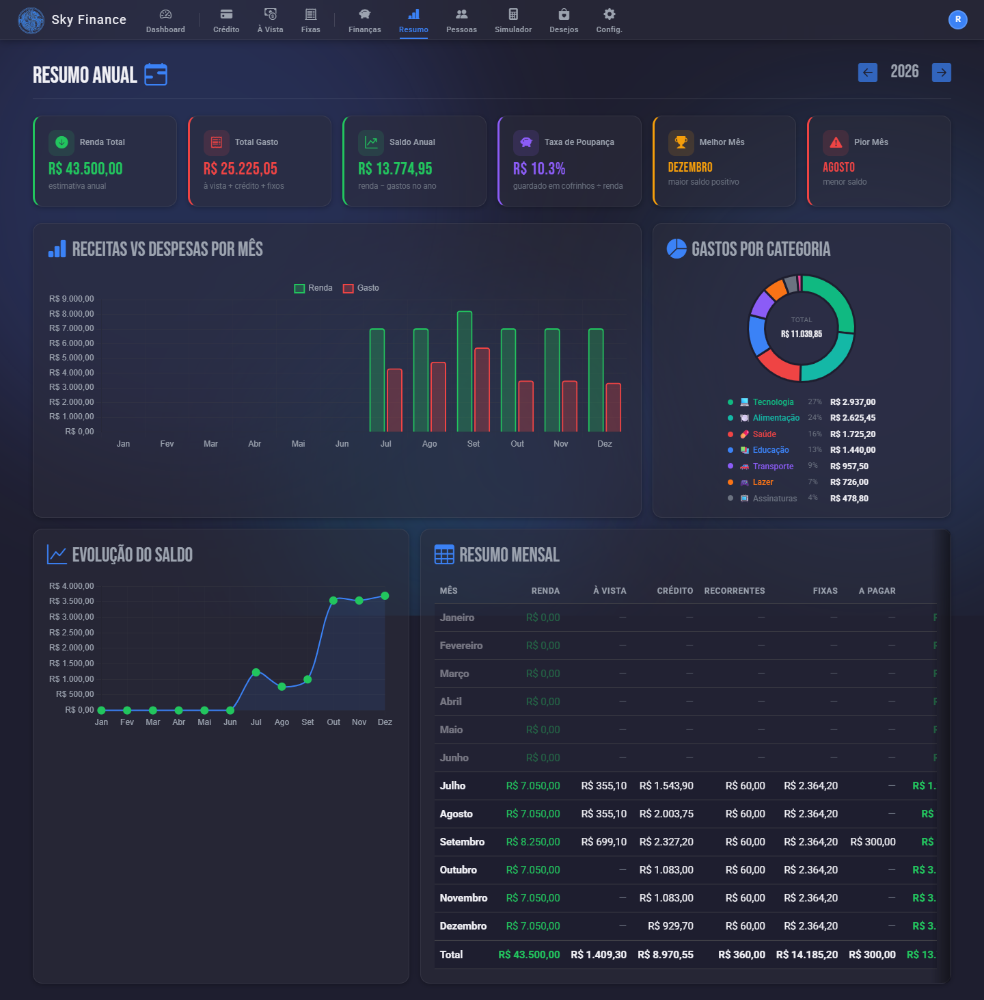

---

### Pessoas (Responsáveis)
Quem te deve e a quem você deve. No crédito, a dívida é quitada quando a fatura é paga; no Pix/débito, pelo check.

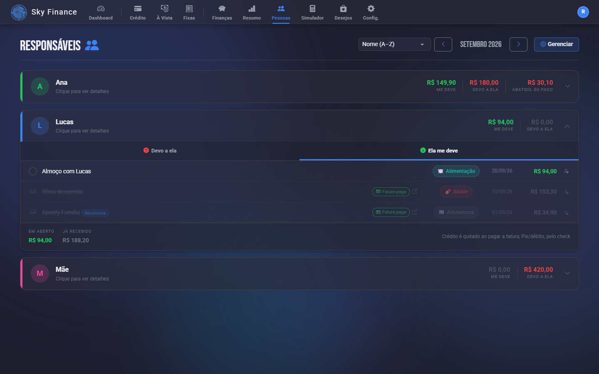

---

### Simulador de Compras
Mostra em quais faturas cada parcela cai e como fica o gasto total de cada mês antes de confirmar a compra.

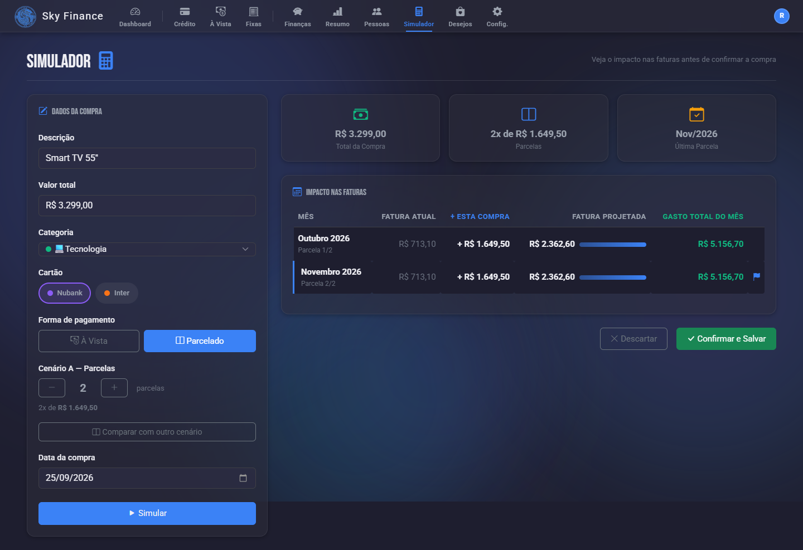

---

### Lista de Desejos
Produtos que você quer comprar, com prioridade, link e simulação de em qual fatura a compra entraria.

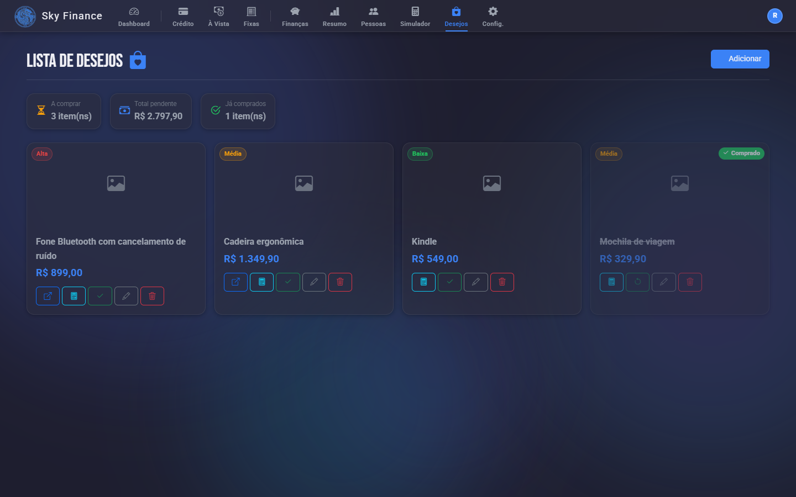

---

### Configurações
Categorias, cartões, recorrentes, pessoas, contas fixas, conta do usuário e backup.

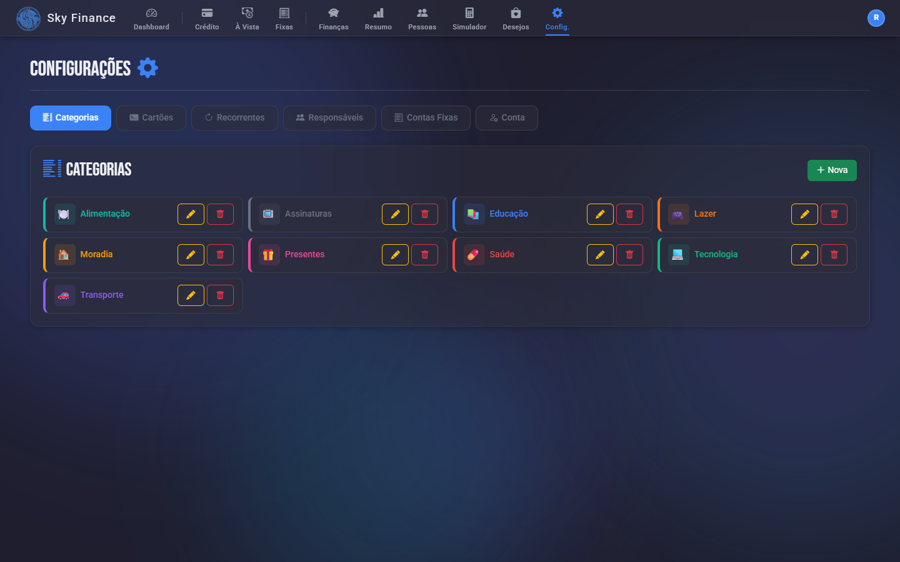

---

### Login

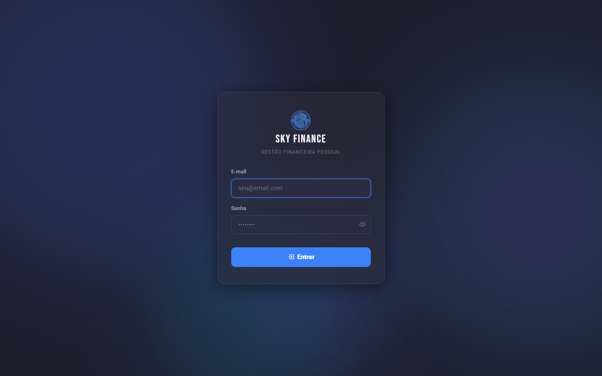

---

## Funcionalidades

### Dashboard
- Saudação com o nome do usuário e seletor de mês/ano
- Cards de **renda**, **total gasto** e **saldo** (renda − gastos − guardado em cofrinhos)
- "**Se me pagarem**": total gasto e saldo descontando o que as pessoas te devem no mês
- Cards menores: à vista, fatura do crédito, recorrentes, contas fixas, a pagar e **me devem** (em aberto / recebido)
- Avisos de contas fixas vencidas ou a vencer e de faturas próximas do vencimento, com ações rápidas (pagar, "não vou pagar este mês")
- Faturas do mês por cartão
- **Parcelas que terminam no mês** e o "alívio" no mês seguinte
- Gráfico de gastos por categoria (clique abre os lançamentos da categoria) e últimas despesas
- Comprometimento da renda e progresso dos cofrinhos

### Cartão de Crédito
- Múltiplos cartões com cor, limite, dia de fechamento e vencimento
- **Fechamento automático** opcional: calcula o fechamento de cada mês a partir do vencimento
- Compra no dia do fechamento ou depois entra na fatura seguinte; vencimento dia 31 se ajusta a meses mais curtos
- Lançamentos à vista, **parcelados** (a última parcela absorve os centavos) e **recorrentes**
- Editar a data ou o cartão de uma compra recalcula a fatura em que ela cai
- Gráfico por categoria com ordenação; **clicar numa categoria (ou fatia) filtra as faturas**
- Marcar fatura como paga (por cartão e mês)
- Despesas podem ser lançadas no nome de outra pessoa ("ela me deve")

### À Vista
- Pix, débito (com cartão) e dinheiro, com categoria e responsável
- Edição, repetição e exclusão direto na linha

### Recorrentes
- Assinaturas e gastos mensais, com ou sem cartão
- **Mudança de valor "a partir de" um mês**: ex.: barbeiro sobe em outubro → setembro continua com o valor antigo
- Inativar ou editar nunca altera os meses que já passaram

### Contas Fixas
- Aluguel, internet, luz etc. com dia de vencimento
- Marcação de pagamento com valor pago e data; o mês pago usa o **valor pago**, então mudar o valor da conta não reescreve o passado
- **"Não vou pagar este mês"**: zera a conta só naquele mês
- **Paga por outra pessoa**: a conta pode ter um responsável padrão (ex.: "dou o dinheiro para a mãe pagar"); ela aparece em "Devo a ela" na tela Pessoas
- Contas valem a partir do mês de criação; inativar/arquivar preserva os meses anteriores

### Finanças
- Fontes de renda recorrentes ou de um mês específico
- **Registrar mudança de renda** a partir de um mês (histórico preservado); pausar uma renda não apaga os meses anteriores
- Orçamento por categoria, por meses/anos, com o gasto do mês (inclui "eu devo" de Pessoas)
- Meta de economia (10% da renda) comparada ao que foi guardado
- Cofrinhos com meta, prazo, cor, rendimento do CDI, aportes, retiradas e histórico

### Resumo Anual
- Renda, gasto, saldo e taxa de poupança do ano
- Melhor e pior mês (considerando só os meses após o marco inicial)
- Gráfico receitas × despesas, evolução do saldo e gastos por categoria
- Tabela mensal com a composição de cada mês

### Pessoas (Responsáveis)
- **Devo a ela**: itens que você deve (à vista ou parcelados) e contas fixas pagas por meio dela, com marcação de pago
- **Ela me deve**: despesas lançadas no nome dela
  - crédito → quitado automaticamente quando a fatura do cartão é marcada como paga (o status abre a fatura)
  - Pix/débito/dinheiro e recorrente sem cartão → check de **recebido**
- Saldo "se abater" quando os dois lados têm valor
- Tirar uma despesa da pessoa sem apagá-la
- Ordenação por nome, "quem me deve mais" ou "a quem devo mais"

### Simulador de Compras
- À vista ou parcelado, com comparação entre dois cenários
- Mostra a fatura atual, o acréscimo e a fatura projetada de cada mês afetado
- Confirma e já lança a compra

### Lista de Desejos
- Nome, link, imagem (busca automática pela prévia do link ou upload), valor e prioridade
- Marcar como comprado
- Simulação de fatura para decidir quando e como comprar

### Configurações
- Categorias com cor e ícone
- Cartões, recorrentes, pessoas e contas fixas
- Perfil (nome, e-mail, foto) e troca de senha
- **Marco inicial**: mês a partir do qual o sistema conta os dados (antes dele tudo aparece zerado)
- Somente administrador: usuários do sistema, backup e "apagar todos os dados"

### Histórico preservado
Nada do que já aconteceu muda por causa de uma ação de hoje:
- **Inativar** recorrente, conta fixa ou renda vale a partir do mês atual
- **Excluir** pessoa, cofrinho ou conta fixa na verdade **arquiva**: some das listas, mas continua nos meses passados
- Categoria excluída continua aparecendo nos meses em que foi usada; compras de cartão excluído aparecem como "Cartão excluído"

### Backup e Restauração
- **Backup automático**: a cada alteração de dados (no máximo um a cada 5 minutos) é gerado um dump com `mysqldump` em `C:/SkyFinanceBackups/auto`, fora da pasta pública. O arquivo só é aceito se estiver completo, e a rotação guarda os 60 mais recentes + 1 por dia dos últimos 30 dias
- Exportar a base completa em `.sql` e importar um backup (um snapshot é salvo antes de restaurar)
- Download do `setup_completo.sql` para criar o banco do zero

### Temas
- Escuro, claro e **gatos espaciais**, pelo menu do avatar
- Preferência salva no navegador e aplicada antes da renderização (sem "piscar")
- Layout responsivo para celular

### Autenticação
- Login com bcrypt (cost 12) e bloqueio por IP após 5 tentativas (15 minutos)
- Sessão com `HttpOnly` e `SameSite=Strict`
- Cadastro público só quando não existe nenhum usuário; depois, usuários são criados pelo administrador
- Cada usuário vê apenas os próprios dados

---

## Tecnologias

| Camada | Tecnologia |
|--------|-----------|
| Backend | PHP 8.2, PDO (MySQL) |
| Banco de dados | MySQL / MariaDB |
| Frontend | Bootstrap 5.2.3, jQuery 3.6 |
| Gráficos | Chart.js |
| Tabelas | DataTables 2.2.2 |
| Alertas | SweetAlert2, Toastr |
| Tooltips | Tippy.js |
| Datas | Moment.js |
| Ícones | Bootstrap Icons |
| Fontes | Google Fonts (Roboto, Bebas Neue) |
| Design | Glassmorphism + aurora animada (CSS puro), temas escuro/claro/gatos |

---

## Estrutura do Projeto

```
Sky_Finance/
├── conn/
│   ├── conn.php              # Credenciais (DB_*) e conexão PDO por usuário (@uid)
│   └── config.php            # BASE_URL e URLs dos controllers
├── php/
│   ├── controllers/          # Endpoints AJAX (JSON), um por funcionalidade
│   ├── middleware/
│   │   └── auth.php          # Exige login (401 em chamadas AJAX)
│   ├── models/               # Consultas SQL por entidade
│   ├── services/
│   │   ├── BackupAutomatico.php    # Dump automático a cada alteração
│   │   └── RecorrentesService.php  # Gera os lançamentos recorrentes do mês
│   ├── templates/            # header (navbar, temas, utilitários JS), footer, modais
│   └── views/                # Telas: crédito, à vista, fixas, finanças, resumo,
│                             # pessoas, simulador, desejos, configurações, backup
├── src/
│   ├── img/                  # Logo, avatares, imagens dos desejos, temas
│   └── js/faturas.js         # Cálculo de em qual fatura cada parcela cai
├── styles/style.css          # Estilos globais, temas e responsividade
├── sql/
│   ├── setup_completo.sql    # Estrutura completa (cria do zero; seguro rodar de novo)
│   ├── contas_fixas_inativado.sql  # Atualiza bancos antigos com as colunas novas
│   └── *.sql                 # Scripts legados
├── docs/screenshots/         # Imagens deste README
├── index.php                 # Dashboard
├── login.php                 # Login / criação da conta inicial
└── logout.php
```

---

## Instalação (XAMPP / Local)

### Pré-requisitos
- PHP 8.2+
- MySQL / MariaDB
- Apache (XAMPP, Laragon etc.)

### Passo a passo

**1. Clone o repositório dentro do diretório web:**
```bash
git clone https://github.com/HickysDev/Sky_Finance.git
cd Sky_Finance
```

**2. Crie o banco de dados:**

No phpMyAdmin (ou no MySQL), importe o script completo — ele cria o banco `projeto` e todas as tabelas:
```sql
source sql/setup_completo.sql
```

> **Atualizando uma instalação antiga?** Rode também `sql/contas_fixas_inativado.sql` (pode rodar mais de uma vez) **antes** de importar um backup feito numa versão mais nova.

**3. Configure a conexão:**

Edite as constantes no início de `conn/conn.php`:
```php
define('DB_HOST', 'localhost');
define('DB_NAME', 'projeto');
define('DB_USER', 'root');
define('DB_PASS', '');
```

**4. Acesse no navegador:**
```
http://localhost/Sky_Finance/
```

Na primeira vez, você cria o usuário administrador.

> O backup automático usa o `mysqldump` do XAMPP (`C:/xampp/mysql/bin`) e grava em `C:/SkyFinanceBackups/auto`. Em outra instalação, ajuste o caminho em `php/services/BackupAutomatico.php` (ou defina `MYSQLDUMP_PATH`).

---

## Instalação (Servidor Linux)

### Pré-requisitos no servidor
```bash
# Apache + PHP + MySQL
sudo dnf install -y httpd php php-mysqlnd php-pdo php-mbstring php-gd php-fileinfo
sudo dnf install -y mysql-server

# Iniciar serviços
sudo systemctl enable --now httpd mysqld

# Liberar porta 80
sudo firewall-cmd --permanent --add-service=http
sudo firewall-cmd --reload
```

### Upload dos arquivos
Use FileZilla ou `scp` para enviar os arquivos para `/var/www/html/Sky_Finance/`.

### Permissões para upload de imagens
```bash
sudo chown -R apache:apache /var/www/html/Sky_Finance/src/img/avatars/ /var/www/html/Sky_Finance/src/img/desejos/
sudo chmod -R 755 /var/www/html/Sky_Finance/src/img/avatars/ /var/www/html/Sky_Finance/src/img/desejos/
```

---

## Segurança

- Senhas com `password_hash()` (bcrypt, cost 12)
- Bloqueio por IP: 5 tentativas incorretas → 15 minutos
- Token CSRF no formulário de login (`hash_equals` na validação)
- Sessão com cookies `HttpOnly` e `SameSite=Strict`
- Todas as queries usam PDO com prepared statements e ficam presas ao usuário logado (`usuario_id = @uid`)
- Todos os controllers exigem login; backup e gestão de usuários só para o administrador
- Upload de imagens com validação do tipo real do arquivo (whitelist)
- Busca de imagem por link com proteção contra acesso a endereços internos

---

## Licença

Este projeto é de uso pessoal. Sinta-se livre para usar como referência ou base para seus próprios projetos.
